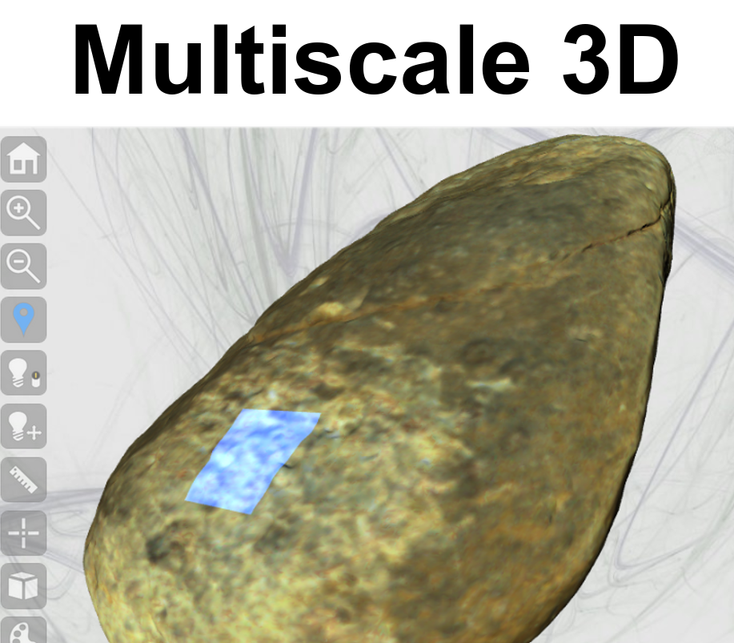

# **Rock art** developments for 3D studies

Multi-scale and multi-paradigm approaches with open source softwares to manage 3D data:

* **WebGL** library allows to render directly `.stl` files (ex: [www/confoc_3d.stl](https://github.com/zoometh/rockart/blob/main/www/confoc_3d.stl));
* **GitHub** offers a simple platform to host 3D objects and 3D viewers;
* **Meshroom** is an open source pipeline for 3D photogrammetry. It can be run from a Python script;
* **Meshlab** works well with 3DHOP. It allows to directly export streamable 3D objects
* **3DHOP** framework offers a showcase that can be integrated into Rmardown document with the Leaflet webmapping library for the (ex: [Mont Bego rock-art site](https://zoometh.github.io/rockart/));
* **Blender** allows to create new 3D features like 3D shapes to locate annotations;
* **reveal.js** is a HTML framework for Powerpoint-like presentations. It allows to add <iframes>, like 3DHOP windows, and set them interactive;
  
  